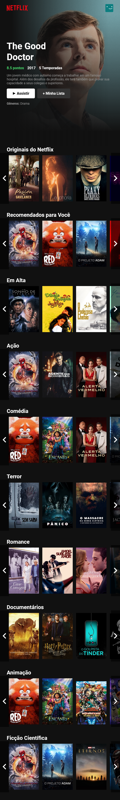
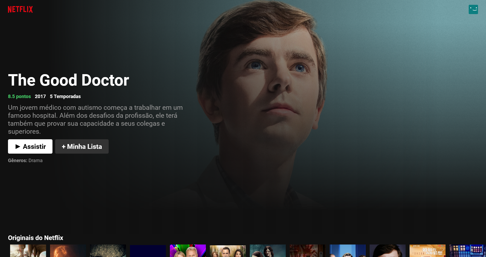
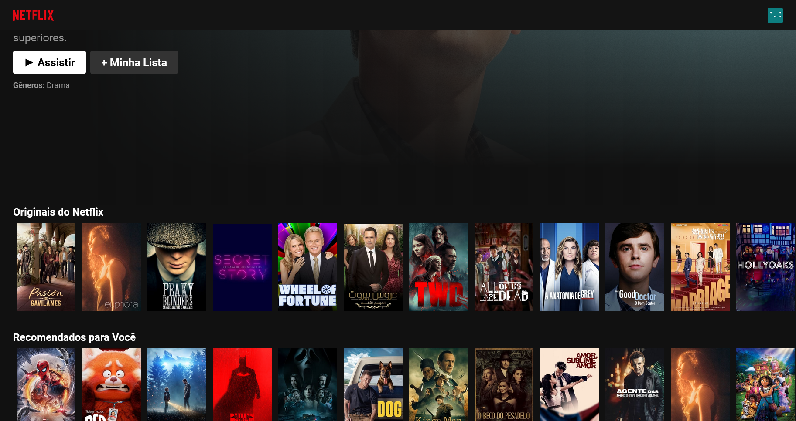

# Netflix Clone

Projeto criado com ReactJs, NodeJs e a API do TheMovieDB.

## Table of contents

-   [Overview](#overview)
    -   [Screenshot](#screenshot)
-   [My process](#my-process)
    -   [Built with](#built-with)
-   [Author](#author)
-   [Credits](#credits)

## Overview

### Screenshot

## My process

### Built with

-   CSS
-   HTML
-   Flexbox
-   JS
-   Responsive
-   JSX
-   [API](https://developers.themoviedb.org/3/) - API TheMovieDB
-   [NodeJS](https://nodejs.org/en/) - JS library
-   [React](https://reactjs.org/) - JS library

## Author

-   Github - [@Flaviogameover](https://github.com/Flaviogameover/)

## Credits

-   Empresa Netflix
-   Canal do Bonieky Lacerda 